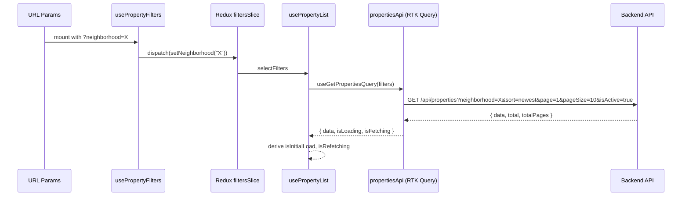

# Design Document: UI–API Integration Refactor

## Overview

This refactor brings the Smart Real Estate ("سمارت العقارية") frontend into full, production-ready alignment with the backend API defined in `api.md`. The application is a React 18 + TypeScript + Redux Toolkit + RTK Query SPA targeting the New Minya (المنيا الجديدة) real-estate market.

The work is purely a frontend refactor — no backend changes are required. The goals are:

1. Decompose `PropertyCard` into focused sub-components (`PriceBadge`, `LocationTag`, `SpecsRibbon`).
2. Surface admin-specific status fields (`ownerSuspended`, `expiresAt`) in the admin UI.
3. Harden RTK Query loading patterns (`isInitialLoad` vs `isRefetching`).
4. Centralise filter-to-query-param derivation with `useMemo`.
5. Extract business logic into custom hooks (`usePropertyList`, `usePropertyFilters`, `useAdminActions`).
6. Align `multipart/form-data` construction with the API spec (Cloudinary images/video, `existingImages`).
7. Upgrade `ErrorState` to handle typed HTTP status codes (401 / 403 / 404 / 500).
8. Enforce `SkeletonCard` layout fidelity and full Arabic ARIA accessibility.
9. Align `AdminUsers` with the full API User object shape (`phone`, `expiresAt`, `email`).
10. Ensure round-trip data integrity between `FormData` serialisation and API responses.

---

## Architecture

The application follows a layered architecture:

```
┌─────────────────────────────────────────────────────────┐
│                        Pages                            │
│  Properties  │  PropertyDetails  │  Admin pages         │
└──────────────────────┬──────────────────────────────────┘
                       │ consume
┌──────────────────────▼──────────────────────────────────┐
│                   Custom Hooks                          │
│  usePropertyList  │  usePropertyFilters  │  useAdminActions │
└──────────────────────┬──────────────────────────────────┘
                       │ call
┌──────────────────────▼──────────────────────────────────┐
│               RTK Query API Slices                      │
│       propertiesApi          │       usersApi           │
└──────────────────────┬──────────────────────────────────┘
                       │ backed by
┌──────────────────────▼──────────────────────────────────┐
│               Redux Store                               │
│  filtersSlice  │  propertiesSlice  │  usersSlice        │
└─────────────────────────────────────────────────────────┘
```

State flow:
- URL search params → `usePropertyFilters` → Redux `filtersSlice` → `usePropertyList` → `propertiesApi` → backend
- Admin form state → `useAdminActions` → `FormData` → `propertiesApi` mutations → cache invalidation



---

## Components and Interfaces

### PropertyCard Sub-components

**`PriceBadge`** — renders price or WhatsApp CTA based on `showPrice`:
```tsx
interface PriceBadgeProps {
  priceFormatted: string;
  showPrice: boolean;
  title: string;        // for WhatsApp message context
  type: string;
  area: number;
  bedrooms: number;
  neighborhood: string;
  location: string;
}
```

**`LocationTag`** — renders neighborhood with MapPin icon:
```tsx
interface LocationTagProps {
  neighborhood: string;  // must be one of the API enum values
  location: string;
}
```

**`SpecsRibbon`** — renders bedrooms (if > 0), bathrooms, area:
```tsx
interface SpecsRibbonProps {
  bedrooms: number;
  bathrooms: number;
  area: number;
}
```

**Updated `PropertyCard`** — composes the three sub-components and adds `aria-label`:
```tsx
interface PropertyCardProps {
  property: Property;
  priority?: boolean;
}
// Link aria-label: `عرض تفاصيل العقار: ${property.title}`
```

---

### SkeletonCard

Mirrors the exact layout of `PropertyCard`:
- Image area: `aspect-[4/3]` (matches `PropertyCard` image)
- Title placeholder, location placeholder, specs row placeholder — same vertical order
- All elements use `<Skeleton>` primitive with `animate-pulse`
- Container: `aria-hidden="true"` and `aria-busy="true"`

---

### ErrorState (upgraded)

```tsx
interface ErrorStateProps {
  statusCode?: 401 | 403 | 404 | 500 | number;
  apiMessage?: string;       // raw message from API response body
  message?: string;          // override display message
  description?: string;
  onRetry?: () => void;
  onLogin?: () => void;      // shown for 401
  onLogout?: () => void;     // shown for 403 "انتهت صلاحية الحساب"
  onBack?: () => void;       // shown for 404
}
```

Status-to-message mapping:
| statusCode | apiMessage | Display message |
|---|---|---|
| 401 | any | يجب تسجيل الدخول أولاً |
| 403 | انتهت صلاحية الحساب | انتهت صلاحية حسابك |
| 403 | غير مصرح: هذا العقار لم يتم إضافته بواسطتك | غير مصرح بالوصول لهذا العقار |
| 404 | any | العنصر المطلوب غير موجود |
| 500 | any | حدث خطأ في الخادم، حاول مجدداً لاحقاً |

---

### Custom Hooks

**`usePropertyFilters`** (updated):
```ts
interface UsePropertyFiltersReturn {
  neighborhood: string;
  type: string;
  priceRange: string;       // memoised API param string
  sort: SortOption;
  page: number;
  hasActiveFilters: boolean;
  setNeighborhood: (v: string) => void;
  setType: (v: string) => void;
  setPriceRange: (v: string) => void;
  setSort: (v: SortOption) => void;
  setPage: (p: number) => void;
  clearFilters: () => void;
}
```
- Uses `useMemo` to derive the `priceRange` API param from Redux state.
- Syncs URL search params to Redux on mount.
- Omits `neighborhood` / `type` from API params when value is `"الكل"`.

**`usePropertyList`** (existing, minor update):
```ts
interface UsePropertyListReturn {
  properties: Property[];
  total: number;
  totalPages: number;
  isInitialLoad: boolean;   // isLoading
  isRefetching: boolean;    // isFetching && !isLoading
  isError: boolean;
  refetch: () => void;
}
```

**`useAdminActions`** (new):
```ts
interface UseAdminActionsReturn {
  buildCreateFormData: (form: PropertyFormState, images: File[], video: File | null) => FormData;
  buildUpdateFormData: (form: PropertyFormState, existingImages: string[], newImages: File[], existingVideo: string, newVideo: File | null) => FormData;
  createProperty: (fd: FormData) => Promise<void>;
  updateProperty: (id: string, fd: FormData) => Promise<void>;
  isCreating: boolean;
  isUpdating: boolean;
}
```

---

### AdminProperties (updated)

- Fetches from `/api/admin/properties` (already done via `useGetPropertiesQuery`).
- For `super_admin` role: renders `ownerSuspended` badge ("موقوف") and `expiresAt` expiry badge ("منتهي الصلاحية") per row.
- Badge visibility is gated on the current user's role (read from `localStorage.adminUser`).

---

### AdminUsers (updated)

- `AdminUser` interface extended with `email`, `phone`, `expiresAt`.
- Create/edit modal: shows `expiresAt` date input only when `role === "property_admin"`.
- Create form: `phone` field with Egyptian mobile number validation (`/^01[0125]\d{8}$/`).
- `usersApi` payloads updated to include `phone` and `expiresAt`.

---

### CustomSelect (updated for a11y)

- Trigger button: `role="combobox"`, `aria-expanded={isOpen}`, `aria-haspopup="listbox"`.
- Dropdown list container: `role="listbox"`.
- Each option button: `role="option"`, `aria-selected={isSelected}`.

---

### Pagination (updated for a11y)

- Wrapped in `<nav aria-label="التنقل بين الصفحات">`.
- Previous/Next buttons: `aria-label="الصفحة السابقة"` / `aria-label="الصفحة التالية"`.
- Page number buttons: `aria-label="الصفحة {n}"`, `aria-current="page"` for active page.

---

## Data Models

### Property (updated TypeScript interface)

```ts
export interface Property {
  // Identifiers
  id: string;          // mapped from API _id
  _id?: string;        // raw API field, optional after mapping

  // Core fields
  title: string;
  description: string;
  price: number;
  priceFormatted: string;
  showPrice: boolean;
  location: string;
  neighborhood: string;
  type: string;

  // Specs
  bedrooms: number;
  bathrooms: number;
  area: number;

  // Media
  image: string;       // first image, convenience field
  images: string[];
  video: string | null;

  // Metadata
  amenities: string[];
  featured: boolean;
  active: boolean;
  addedBy: string;
  contactPhone?: string;
  ownerSuspended?: boolean;  // admin responses only
  createdAt: string;
}
```

### AdminUser (updated TypeScript interface)

```ts
export interface AdminUser {
  id: string;
  name: string;
  username: string;
  email?: string;
  phone?: string;
  role: UserRole;
  active: boolean;
  expiresAt: string | null;
  createdAt: string;
}
```

### CreateUserPayload (updated)

```ts
export interface CreateUserPayload {
  name: string;
  username?: string;
  email?: string;
  phone: string;
  password: string;
  role: UserRole;
  active?: boolean;
  expiresAt?: string | null;
}
```

### UpdateUserPayload (updated)

```ts
export interface UpdateUserPayload {
  name?: string;
  username?: string;
  email?: string;
  phone?: string;
  password?: string;
  role?: UserRole;
  active?: boolean;
  expiresAt?: string | null;
}
```

### PropertyFormState (internal hook state)

```ts
interface PropertyFormState {
  title: string;
  description: string;
  price: string;
  neighborhood: string;
  type: string;
  area: string;
  bedrooms: string;
  bathrooms: string;
  amenities: string[];
  featured: boolean;
  active: boolean;
  showPrice: boolean;
}
```

---

## Correctness Properties

*A property is a characteristic or behavior that should hold true across all valid executions of a system — essentially, a formal statement about what the system should do. Properties serve as the bridge between human-readable specifications and machine-verifiable correctness guarantees.*

### Property 1: PriceBadge renders correctly based on showPrice

*For any* property object, if `showPrice` is `false` then the rendered `PriceBadge` output must contain a WhatsApp link (`wa.me`) and must not contain `priceFormatted`; if `showPrice` is `true` then the rendered output must contain `priceFormatted` and must not contain a WhatsApp link.

**Validates: Requirements 1.2, 1.3**

---

### Property 2: SpecsRibbon omits bedrooms when zero

*For any* property with `bedrooms > 0`, the rendered `SpecsRibbon` must display the bedrooms value; *for any* property with `bedrooms === 0`, the rendered `SpecsRibbon` must not display a bedrooms indicator.

**Validates: Requirements 1.5, 1.6**

---

### Property 3: Admin property badge display matches ownerSuspended and expiresAt

*For any* admin property row, if `ownerSuspended` is `true` then a "موقوف" badge must be present; if `expiresAt` is a date in the past then a "منتهي الصلاحية" badge must be present; if `ownerSuspended` is `false` and `expiresAt` is `null` or in the future then neither badge must be present.

**Validates: Requirements 2.1, 2.2, 2.3**

---

### Property 4: isInitialLoad and isRefetching are correctly derived

*For any* combination of `isLoading` and `isFetching` values from RTK Query, `isInitialLoad` must equal `isLoading` and `isRefetching` must equal `isFetching && !isLoading`.

**Validates: Requirements 3.3**

---

### Property 5: "الكل" filter values are omitted from API query params

*For any* filter state where `neighborhood` is `"الكل"` or `type` is `"الكل"`, the corresponding parameter must not appear in the API request URL. *For any* filter state where these values are not `"الكل"`, the parameters must be present.

**Validates: Requirements 4.3, 4.4**

---

### Property 6: Page resets to 1 on any filter change

*For any* current page value and any filter change (neighborhood, type, priceRange, or sort), the resulting page in Redux state must be `1`.

**Validates: Requirements 6.2**

---

### Property 7: hasActiveFilters reflects Redux filter state

*For any* Redux filter state, `hasActiveFilters` must be `true` if and only if at least one of `neighborhood !== "الكل"`, `type !== "الكل"`, or `priceRange !== "all"` is true.

**Validates: Requirements 6.4**

---

### Property 8: FormData round-trip preserves property fields

*For any* valid `PropertyFormState` with a non-empty amenities array, serialising via `buildCreateFormData` must produce a `FormData` where the `amenities` field parses back via `JSON.parse` to an array equal to the original, and all other required fields (`title`, `description`, `price`, `neighborhood`, `type`, `area`, `bedrooms`, `bathrooms`, `featured`, `active`, `showPrice`) are present with their string-coerced values.

**Validates: Requirements 7.1, 7.2, 13.1, 13.4**

---

### Property 9: ErrorState maps HTTP status codes to correct Arabic messages

*For any* `statusCode` in `{401, 403, 404, 500}` and any `apiMessage`, the rendered `ErrorState` must display the correct Arabic message as defined in the status-to-message mapping table. For `403`, the displayed message must depend on the `apiMessage` value.

**Validates: Requirements 9.2, 9.3, 9.4, 9.5, 9.7**

---

### Property 10: PropertyCard aria-label contains property title

*For any* property, the `<Link>` element rendered by `PropertyCard` must have an `aria-label` attribute that contains the string `"عرض تفاصيل العقار: "` followed by `property.title`.

**Validates: Requirements 11.4**

---

### Property 11: CustomSelect aria-expanded reflects open/closed state

*For any* `CustomSelect` instance, when the dropdown is open the trigger button must have `aria-expanded="true"`, and when closed it must have `aria-expanded="false"`.

**Validates: Requirements 11.3**

---

### Property 12: Egyptian phone number validation

*For any* string matching the pattern `01[0125]\d{8}` (with optional `+20` prefix), the phone validation must accept it; *for any* string not matching this pattern, the validation must reject it.

**Validates: Requirements 12.3**

---

### Property 13: expiresAt field visibility depends on role

*For any* AdminUsers modal, when `role` is `"property_admin"` the `expiresAt` input must be present in the DOM; when `role` is `"super_admin"` the `expiresAt` input must be absent.

**Validates: Requirements 12.1, 12.2**

---

### Property 14: API _id is mapped to id in Property objects

*For any* API response containing a property with `_id` field, the internal `Property` object used by the UI must have an `id` field equal to the `_id` value from the response.

**Validates: Requirements 13.3**

---

## Error Handling

### Network / API Errors

All RTK Query endpoints use `queryFn` with explicit error returns. The `ErrorState` component is the single point of error rendering across the app.

Error propagation flow:
1. RTK Query `queryFn` returns `{ error: result.error }` on failure.
2. The consuming hook/component reads `isError` and the error object.
3. The error object's `status` (HTTP code) and `data.message` (API body) are passed to `ErrorState`.
4. `ErrorState` maps these to the correct Arabic display message and action button.

### Specific Error Scenarios

| Scenario | HTTP Status | API Message | UI Response |
|---|---|---|---|
| Unauthenticated admin access | 401 | any | ErrorState with login redirect |
| Expired account | 403 | انتهت صلاحية الحساب | ErrorState with logout action |
| Unauthorised property access | 403 | غير مصرح... | ErrorState, no action |
| Property not found | 404 | العقار غير موجود | ErrorState with back navigation |
| Server error | 500 | any | ErrorState with retry |

### Form Validation Errors

- Price minimum: 55,000 EGP (client-side, before FormData construction)
- Phone: Egyptian mobile pattern `/^(\+?20)?01[0125]\d{8}$/`
- Required fields: validated via HTML `required` attribute + pre-submit check in `useAdminActions`
- API 400 validation errors: displayed via `toast.error` with the `message` from the response body

### Loading State Errors

- `isInitialLoad` error: full-page `ErrorState` with retry
- `isRefetching` error: toast notification (non-blocking, grid remains visible)

---

## Testing Strategy

### Dual Testing Approach

Both unit tests and property-based tests are required. They are complementary:
- Unit tests catch concrete bugs in specific scenarios and verify integration points.
- Property-based tests verify universal correctness across all valid inputs.

### Property-Based Testing

The project already has `fast-check` installed (`"fast-check": "^4.6.0"` in `devDependencies`) and Vitest configured with jsdom. All property tests use `fast-check` with a minimum of **100 runs per property**.

Each property test must be tagged with a comment in this format:
```
// Feature: ui-api-integration-refactor, Property {N}: {property_text}
```

Property test file locations:
- `src/components/__tests__/PropertyCard.property.test.tsx` — Properties 1, 2, 10
- `src/hooks/__tests__/usePropertyFilters.property.test.ts` — Properties 5, 6, 7
- `src/hooks/__tests__/useAdminActions.property.test.ts` — Property 8
- `src/components/__tests__/ErrorState.property.test.tsx` — Property 9
- `src/components/__tests__/CustomSelect.property.test.tsx` — Property 11
- `src/utils/__tests__/phoneValidation.property.test.ts` — Property 12
- `src/components/__tests__/AdminUsers.property.test.tsx` — Property 13
- `src/store/__tests__/propertiesApi.property.test.ts` — Property 14
- `src/hooks/__tests__/usePropertyList.property.test.ts` — Property 4

### Unit Tests

Unit tests focus on:
- Specific rendering examples (skeleton states, error states, empty states)
- Integration between hooks and components
- Edge cases not covered by property generators (e.g. `bedrooms === 0`)
- ARIA attribute presence (11.1, 11.2, 11.5, 11.6)
- Admin role-gated rendering (2.4)

Unit test file locations:
- `src/components/__tests__/PropertyCard.test.tsx`
- `src/components/__tests__/SkeletonCard.test.tsx`
- `src/components/__tests__/FeaturedProperties.test.tsx`
- `src/pages/__tests__/Properties.test.tsx`
- `src/pages/admin/__tests__/AdminProperties.test.tsx`
- `src/pages/admin/__tests__/AdminUsers.test.tsx`
- `src/components/__tests__/CustomSelect.test.tsx`

### Test Configuration

```ts
// vitest.config.ts — already configured with jsdom + @testing-library/react
// fast-check default runs: fc.configureGlobal({ numRuns: 100 })
```

Each correctness property must be implemented by a **single** property-based test function. Unit tests may cover multiple related examples in one `describe` block.
